# Skin Cancer Classification using Deep Learning
## [:film_projector: Presentation Link](https://youtu.be/OEcFbeO88fQ) | [:pencil2:How to use the tool](https://youtu.be/60tc351UIxw)


# Abstract
In cancer, there are over 200 different forms. Out of 200, melanoma is the deadliest form of skin cancer. The diagnostic procedure for melanoma starts with clinical screening, followed by dermoscopic analysis and histopathological examination. Melanoma skin cancer is highly curable if it gets identified at the early stages. The first step of Melanoma skin cancer diagnosis is to conduct a visual examination of the skin's affected area. Dermatologists take the dermatoscopic images of the skin lesions by the high-speed camera, which have an accuracy of 65-80% in the melanoma diagnosis without any additional technical support. With further visual examination by cancer treatment specialists and dermatoscopic images, the overall prediction rate of melanoma diagnosis raised to 75-84% accuracy. The project aims to build an automated classification system based on image processing techniques to classify skin cancer using skin lesions images.

# Introduction and Background
Among all the skin cancer type, melanoma is the least common skin cancer, but it is responsible for **75%** of death [SIIM-ISIC Melanoma Classification, 2020](https://www.kaggle.com/c/siim-isic-melanoma-classification). Being a less common skin cancer type but is spread very quickly to other body parts if not diagnosed early. The **International Skin Imaging Collaboration (ISIC)** is facilitating skin images to reduce melanoma mortality. Melanoma can be cured if diagnosed and treated in the early stages. Digital skin lesion images can be used to make a teledermatology automated diagnosis system that can support clinical decision.

Currently, deep learning has revolutionised the future as it can solve complex problems. The motivation is to develop a solution that can help dermatologists better support their diagnostic accuracy by ensembling contextual images and patient-level information, reducing the variance of predictions from the model.

## The problem we tried to solve
*The first step to identify whether the skin lesion is malignant or benign for a dermatologist is to do a skin biopsy. In the skin biopsy, the dermatologist takes some part of the skin lesion and examines it under the microscope. The current process takes almost a week or more, starting from getting a dermatologist appointment to getting a biopsy report. This project aims to shorten the current gap to just a couple of days by providing the predictive model using **Computer-Aided Diagnosis (CAD)**. The approach uses **Convolutional Neural Network (CNN)** to classify nine types of skin cancer from outlier lesions images. This reduction of a gap has the opportunity to impact millions of people positively.*

## Motivation
The overarching goal is to support the efforts to reduce the death caused by skin cancer. The primary motivation that drives the project is to use the advanced image classification technology for the well-being of the people. Computer vision has made good progress in machine learning and deep learning that are scalable across domains. With the help of this project, we want to reduce the gap between diagnosing and treatment. Successful completion of the project with higher precision on the dataset could better support the dermatological clinic work. The improved accuracy and efficiency of the model can aid to detect melanoma in the early stages and can help to reduce unnecessary biopsies.

## Application
We aim to make it accessible for everyone and leverage the existing model and improve the current system. To make it accessible to the public, we build an easy-to-use website. The user or dermatologist can upload the patient demographic information with the skin lesion image. With the image and patient demographic as input, the model will analyse the data and return the results within a split second. Keeping the broader demographic of people in the vision, we have also tried to develop the basic infographic page, which provides a generalised overview about melanoma and steps to use the online tool to get the results.

## Dataset
The project dataset is openly available on Kaggle [(SIIM-ISIC Melanoma Classification, 2020)](https://www.kaggle.com/c/siim-isic-melanoma-classification). It consists of around forty-four thousand images from the same patient sampled over different weeks and stages. The dataset consists of images in various file format. The raw images are in **DICOM (Digital Imaging and COmmunications in Medicine)**, containing patient metadata and skin lesion images. DICOM is a commonly used file format in medical imaging. Additionally, the dataset also includes images in **TFRECORDS (TensorFlow Records)** and JPEG format.

Furthermore, thirty-three thousand are in training set among the forty-four thousand images and around eleven thousand in the test set. However, our quick analysis found a significant class imbalance in the training dataset. Thirty-two thousand are labelled as **benign (Not Cancerous)** and only five hundred marked as **malignant (Cancerous)**. That is, the training set contains only ±1.76% of malignant images (Figure 1). Along with the patient's images, the dataset also has a CSV file containing a detail about patient-level contextual information, which includes patient id, gender, patient age, location of benign/malignant site, and indicator of malignancy for the imaged lesion.

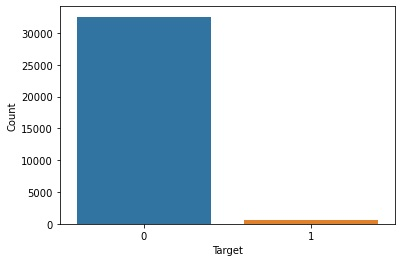

*Figure 1: Class imbalance*

To overcome the issue of class imbalance, we planned to include data from the year 2018 [(ISIC, 2018)](https://challenge2018.isic-archive.com/) and 2019 [(ISIC, 2019)](https://challenge2019.isic-archive.com/) competition with our existing 2020 Kaggle competition [(SIIM-ISIC Melanoma Classification, 2020)](https://www.kaggle.com/c/siim-isic-melanoma-classification). Out of 25k images in the 2019 competition, it has ten times (17.85%) more positive sample ratio, making the metrics more stable (Figure 2).

```
2020 Raw DataSet
Total images in Train set 2020:  33126
Total images in Test set 2020:  10982

2019 Raw DataSet
Total images in Train set 2019:  25331
Total images in Train Ground_truth set 2019:  25331
Total images in Test set 2019:  8238

2018 Raw DataSet
Total images in Train set 2018:  10015
Total images in Train Ground_truth set 2018:  10015
Total images in Validation set Ground Truth set 2019:  193
```
*Figure 2: Training and testing images in 2020, 2019 and 2018 competition.*

#### ***Note: Processed dataset can be directly downloaded from the [Kaggle Discussions](https://www.kaggle.com/c/siim-isic-melanoma-classification/discussion/164092)***

### [Sample Images From Dataset](./Data/Sample%20Images/)

Figure 3 is labelled as benign melanoma in the dataset.

<p align="center">
  
&nbsp; &nbsp; &nbsp; &nbsp;
  
&nbsp; &nbsp; &nbsp; &nbsp;
  
</p>

*Figure 3: Not Cancerous*

Figure 4 is labelled as malignant melanoma in the dataset.

<p align="center">
  
&nbsp; &nbsp; &nbsp; &nbsp;
  
&nbsp; &nbsp; &nbsp; &nbsp;
  
</p>

*Figure 4: Cancerous*

## [Data Pre-Processing](./Notebooks/Data%20Preprocessing.ipynb)
In any machine learning project, it is critical to set up a trustworthy validation scheme, in order to properly evaluate and compare models. This is especially true if the dataset is small to medium size, or the evaluation metric is unstable, which is the case of this project.

There are **33k images in train data**. However, only 1.76% are positive samples (i.e., malignant). The small number of positives causes the AUC metric to be very unstable, even with 5-fold cross validation.

*Our solution to this problem is to use both last year (including [2018](https://challenge2018.isic-archive.com/) and [2019](https://challenge2019.isic-archive.com/)) and this year's data ([2020](https://www.kaggle.com/c/siim-isic-melanoma-classification)). Even though last year's data is smaller (25k), it has 10 times (17.85%) the positive sample ratio, making the metrices much more stable.*

For a typical image classification problem, the standard approach is to take a deep CNN model (such as the most popular EffcientNet) trained on ImageNet, replace the last layer so that the output dimension equals the target's dimension, and fine tune it on the specific dataset.

The target to predict in [this year's (2020) competition](https://www.kaggle.com/c/siim-isic-melanoma-classification) is binary-benign (i.e. no melanoma) or malignant (i.e. melanoma). We noticed that the target information is included in the diagnosis column: target is malignant if and only if diagnosis is melanoma. But diagnosis column is more granular when an image is benign. We believed using diagnosis as target to train the model could give the model more information.

The fact that diagnosis was the target to predict in last year's competition (including [2018](https://challenge2018.isic-archive.com/) and [2019](https://challenge2019.isic-archive.com/)) makes this choice more logical. There is a small problem though. The set of diagnosis is different between this year and last year. We solved it by mapping this year's diagnosis to last year's according to the descriptions on [last year's website](https://challenge2019.isic-archive.com/). See Table 1 for the mapping. There are 9 target values in most of our models. In one model, we only used 4 target values (NV, MEL, BKL and Unknown) by mapping the other five (*) to Unknown.

| 2019 Diagnosis | 2020 Diagnosis                                                              | Target  |
|----------------|-----------------------------------------------------------------------------|---------|
| NV             | nevus                                                                       | NV      |
| MEL            | melanoma                                                                    | MEL     |
| BCC            |                                                                             | BCC*    |
| BKL            | seborrheic keratosis<br>lichenoid keratosis<br>solar lentigo<br>lentigo NOS | BKL     |
| AK             |                                                                             | AK*     |
| SCC            |                                                                             | SCC*    |
| VASC           |                                                                             | VASC*   |
| DF             |                                                                             | DF*     |
|                | cafe-au-lait macule<br>atypical melanocytic proliferation                   | Unknown |

*Table 1: Mapping from diagnosis to targets.*

This means that the last layer of our classification model has 9-dimensional output. It is trained with cross entropy loss. 

## [Data Augmentation](./Notebooks/Data%20Augumentation.ipynb)

In a small size dataset, image augmentation is required to avoid overfitting the training dataset. After data aggregation, we have around **46k images in the training set**. The dataset contains significant class imbalance, with most of the classes have an **"Unknown"** category (Table 2). We have defined our augmentation pipeline to deal with the class imbalance. The augmentation that helps to improve the prediction accuracy of the model is selected. The selected augmentation are as follows:
1. **Transpose**: A spatial level transformation that transposes image by swapping rows and columns.
2. **Flip**: A spatial level transformation that flip image either/both horizontally and/or vertically. Images are randomly flipped either horizontally or vertically to make the model more robust.
3. **Rotate**: A spatial level transformation that randomly turns images for uniform distribution. Random rotation allows the model to become invariant to the object orientation.
4. **RandomBrightness**: A pixel-level transformation that randomly changes the brightness of the image. As in real life, we do not have object under perfect lighting conditions and this augmentation help to mimic real-life scenarios.
5. **RandomContrast**: A pixel-level transformation that randomly changes the contrast of the input image. As in real life, we do not have object under perfect lighting conditions and this augmentation help to mimic real-life scenarios.
6. **MotionBlur**: A pixel-level transformation that applies motion blur using a random-sized kernel.
7. **MedianBlur**: A pixel-level transformation that blurs input image using a median filter.
8. **GaussianBlur**: A pixel-level transformation that blurs input image using a gaussian filter.
9. **GaussNoise**: A pixel-level transformation that applies Gaussian noise to the image. This augmentation will simulate the measurement noise while taking the images
10. **OpticalDistortion**: Optical distortion is also known as Lens error. It mimics the lens distortion effect.
11. **GridDistortion**: An image warping technique driven by mapping between equivalent families of curves or edges arranged in a grid structure.
12. **ElasticTransform**: A pixel-level transformation that divides the images into multiple grids and, based on edge displacement, the grid will be distorted. This transform helps the network to have a better understanding of edges while training.
13. **CLAHE**: A pixel-level transformation that applies Contrast Limited Adaptive Histogram Equalization to the input image. This augmentation improves the contrast of the images.
14. **HueSaturationValue**: A pixel-level transformation that randomly changes hue, saturation and value of the input image.
15. **ShiftScaleRotate**: A spatial level transformation that randomly applies affine transforms: translate, scale and rotate the input. The allow scale and rotate the image by certain angles
16. **Cutout**: A spatial level transformation that does a rectangular cut in the image. This transformation helps the network to focus on the different areas in the images.

Figure 5 illustrates the before and after augmented image. The augmentation is applied to only the training set while just normalising the validation and testing dataset.

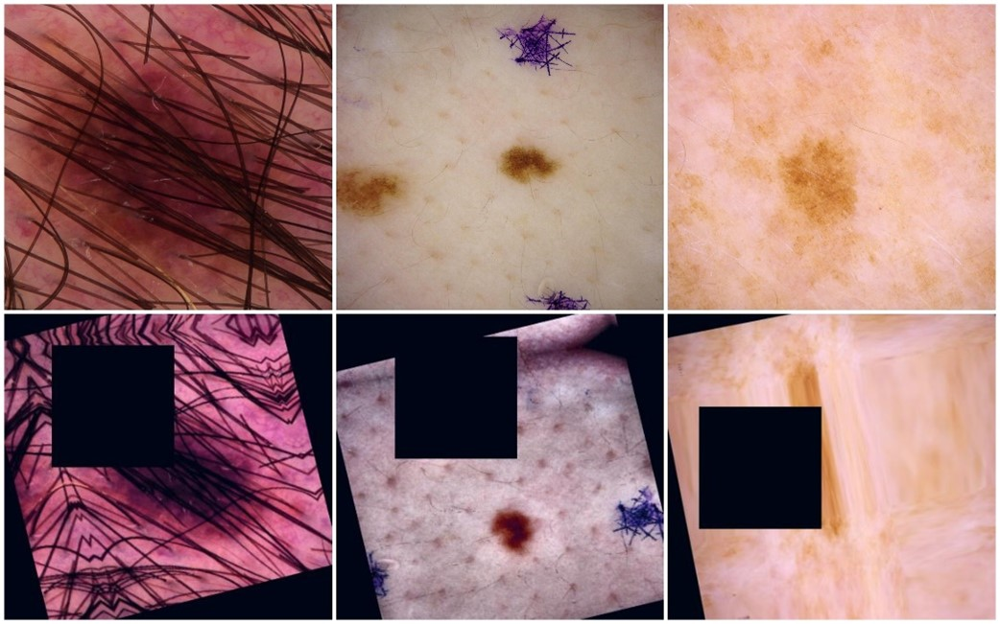

*Figure 5 Training set augmentation.*

*After the data pre-processing and data augmentation, we have around 46,425 images in the training set, 11,606 images in the validation set and 10,875 images in the testing set. The training set is divided into an 80/20 ratio where 80% is used for training and 20% as a validation set.*

####  ***You can view more Augmented samples under [`./Data/Augmented Sample Images`](./Data/Augmented%20Sample%20Images/)***

# Overview of the Architecture
The project contains two flow diagrams. Figure 6 shows the model training pipeline, while Figure 7 shows the web UI flow. The first step after downloading the data is to clean and combine the data (Figure 6). The missing values in the patient demographic are imputed with the average values as the ratio of missing values is less than 5% in the overall dataset. The provided skin lesion images are of higher resolution, and it is not ideal for training the network on the high-resolution images (Figure 3 and 4). *In the data pre-processing steps, all images are cropped into 768x786 and 512x512 resolution to reduce random noise on the edges of the image.*

The data cleaning and pre-processing step are performed on all the dataset obtained from the 2020, 2019 and 2018 competition. Also, the image labels are reconciled and combined into a single training CSV file. The augmentation is performed on the fly during the model training process to reduce the storage space and improve efficiency. **During the model training part, **Nth** images are read from the training folder and augmentation is performed on the CPU while the EfficientNet is loaded in the GPU. Augmentation is performed on the CPU, and training on GPU help to reduce the training time (Figure 6).**

After each epoch, we check the validation accuracy of the model. If the validation accuracy does not increase after 15 epochs, the training process is stopped, and the best model weights are saved for the prediction (Figure 6). The prediction is performed on the test set, and results are stored in the CSV file. Along with the model weights, all diagnostic information for the model is stored locally.

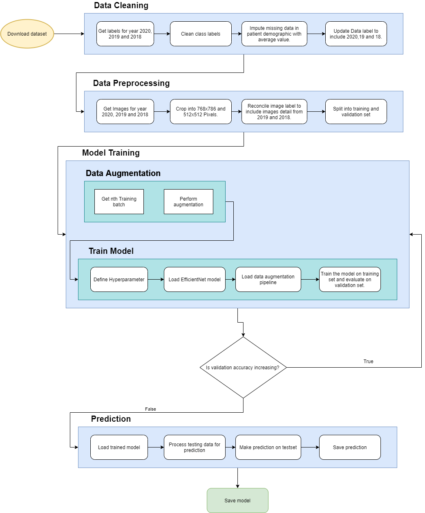

*Figure 6 Model training flow diagram*

The web UI contains five pages, of which four of them are used to explain the project and how to use the proposed CAD system (Figure 7). The inference page named [**"Our Solution"**](ttp://20.70.244.24/test) is where the inference is made on the skin lesion images. All the validation is performed on the client-side to reduce the server overload. If the inserted information is not correct, then an error notification popup is shown; any user can easily understand that. Validated data is passed onto the server, where inference is performed by Onnx network, and response is return in the JSON format. On the website, we have configured the JQuery, which listen for server response. As soon as the response is return, the information is populated in a graphical format. Plus, for user convenience, we provide the functionality in which a user can generate the report in PDF format (Figure 7).

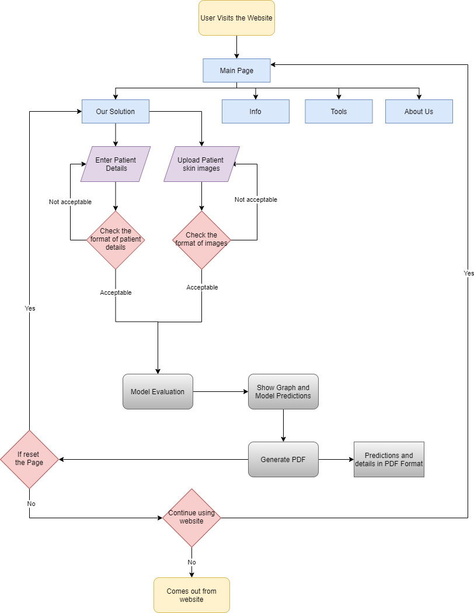

*Figure 7 Web UI flow diagram*

## [CNN Architecture Design](./Src/Model%20Training/pre_train.py)
The project aims to classify skin cancer using skin lesions images. To achieve higher accuracy and results on the classification task, we have used various EfficientNet models. Transfer learning is applied to the EfficientNet models. **We have unfrozen all the layer except BatchNormalization to stop the BatchNormalization layer from updating its means and variance statistics. If we train the BatchNormalisation layer, it will destroy what the model has learned, and accuracy will significantly reduce.**

### The reason behind choosing EfficientNet Architecture
We have explored several different pre-trained models like VGG-16, VGG-19, ResNet-50 and ResNet-200. But the issue with these pre-train models is that they are depth scaled, meaning they are scaled up or down by adding or removing layers. For example, ResNet-50 is scaled up to ResNet-200 by adding more layers. Theoretically, adding layers to the network help to improve the performance, but it does not follow the same when implemented practically. As more layers are added to the network, it will face a vanishing gradient problem.

CNN's can be scaled with three dimensions: depth (d), width (w), and resolution (r). Depth scaling is adding or removing layers in the network. Width scaling makes the network wider, while resolution scaling increases or decreases image resolution passed in the CNN.

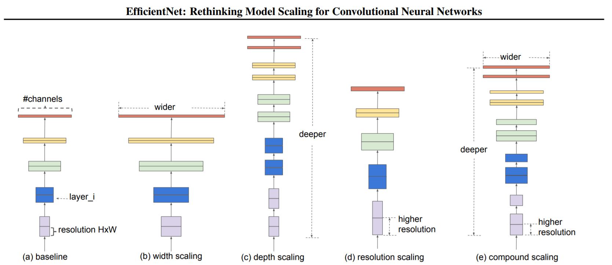

*Figure 8, Scaling dimension [(Mingxing & Quoc, 2019)](https://arxiv.org/pdf/1905.11946.pdf)*

Scaling width, depth and resolution improve network accuracy. However, it quickly saturates as the network is scaled only in a single dimension. From Figure 9, we can see that the baseline network (Figure 8) saturates at 80% when scaled in a single dimension.

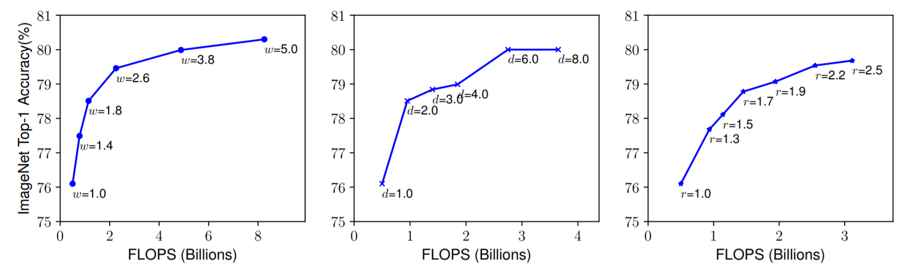

*Figure 9, Accuracy saturation when scaling on a single dimension [(Mingxing & Quoc, 2019)](https://arxiv.org/pdf/1905.11946.pdf)*

EfficientNet used compound scaling (Figure 8), which uniformly scales the network's width, depth, and resolution. Among the different EfficientNet, EfficientNetB0 is the baseline network obtained by doing **Neural Architecture Search (NAS)**. EfficientNetB1 to B7 is built upon the baseline network having a different value of compound scaling. 

**We have chosen to use EfficientNet B4, B5 and B7 as these model achieved start-of-the-art 84.4% top-1/ 97.1% top 5 accuracies (Mingxing & Quoc, 2019) on the ImageNet competition.**

####  ***You can view the CNN model visualisation under [Model Visualisation.](./Model%20Visualisation/)***

####  ***To start the training process run [`./Src/Model%20Training/main_run.py`](./Src/Model%20Training/main_run.py) file. Also, to create a Compute Instance on Azure refer to [`./Src/README.md`](https://github.com/Tirth27/Skin-Cancer-Classification-using-Deep-Learning/blob/main/Src/README.md)***

## GUI Design
To tackle the challenge of identifying skin cancer from skin lesions, we have to build a predictive model for **Computer-Aided Diagnosis (CAD)**. Taking the skin lesions image and patient demographic information as input, we have developed a prototype web application that can help dermatologists interpret skin lesion images.

The web GUI consists of five main pages, of which four of them are used to explain the benefit of using the tool and way to reduce the death caused by skin cancer. The inference page named **"Our Solution"** is where the inference is performed using ensemble methodology.

The main page introduces the user to the approach we have chosen to scale across the domain where we merge the deep learning technology with the health care sector. Also, the main pages have four main sections (Figure 10, 11, 12 and 13). We have added button on the navigation bar for user convenience, which takes the user to the specified section.


*Figure 10 Main page (Section one)*

We introduce the end-user to the melanoma and its severity in section two (Figure 11). Section two provides a generalised introduction of melanoma that the user can easily understand. Plus, we have provided a **"Explore"** button that redirects the user to the **"Info"** page (Figure 12). The information page provides in-depth information on the severity of skin cancer with its symptoms. The information page (Figure 12) is designed to keep the curious user in mind who wants to understand the problem profoundly.

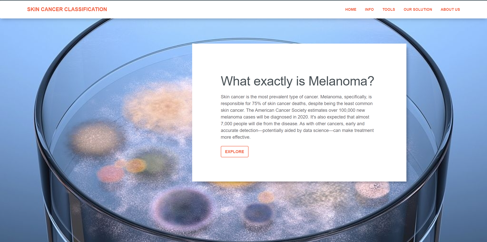

*Figure 11 Main page (section two)*

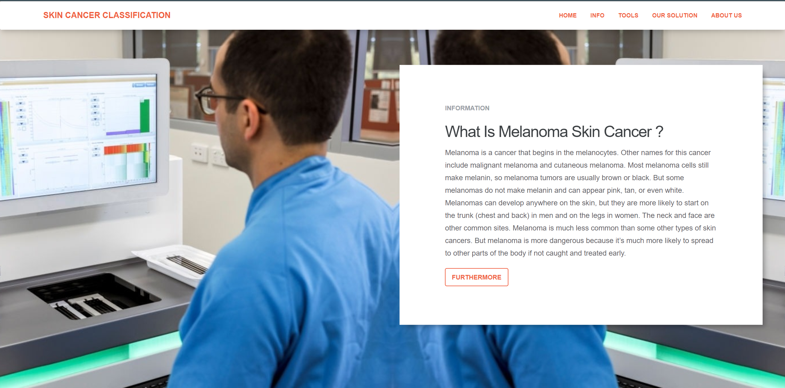

*Figure 12 Info Page*

Once the user is familiar with skin cancer, we took the user to section three (Figure 13), showing how deep learning can help dermatologist in their clinical work. When the user clicks on the **"Explore"** button, they are redirected to the **"Tools"** page. The tools page will make the user familiar with deep learning and how it can help to reduce the death caused by melanoma skin cancer.

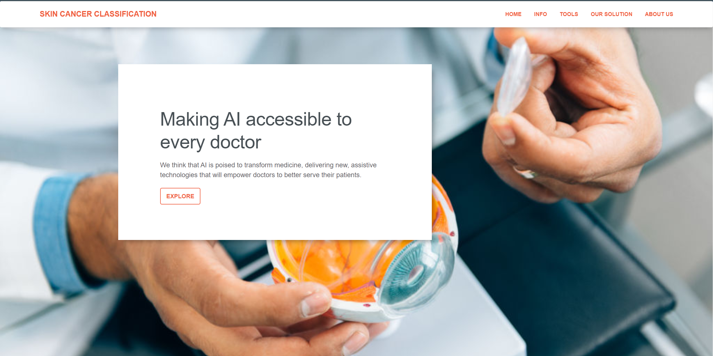

*Figure 13 Main page (Section three)*

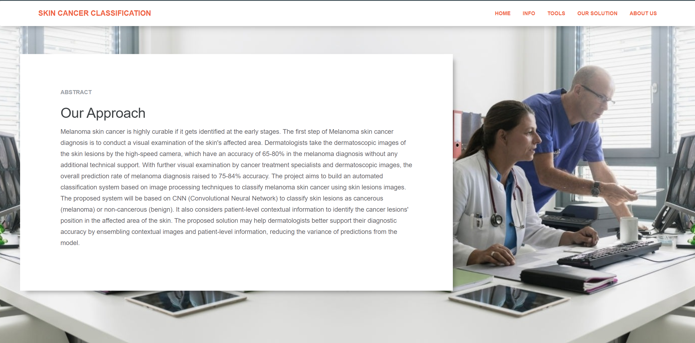

*Figure 14 Tools Page*

In the last section of the main page (Figure 15), we introduce our CAD system. When **"Explore Our Solution"** is click, it will bring the end-user to the **"Our Solution"** page. The **"Our Solution"** page is where the inference of the skin lesion image is performed (Figure 16). The minimal materialised design is chosen, which looks attractive and encourage end-user to use the tool repeatedly.

The **"Our Solution"** page contains two main things. Firstly, a user needs to add the patient detail under the **"Fill Patient Detail"** section for which the inference is performed. Then a user needs to upload the skin lesion image. The validation is performed on the client-side using JQuery, and it will not allow the end-user to submit the detail until all the information is valid. The validation is performed on the client-side to reduce the server load.


*Figure 15 Main page (section four)*

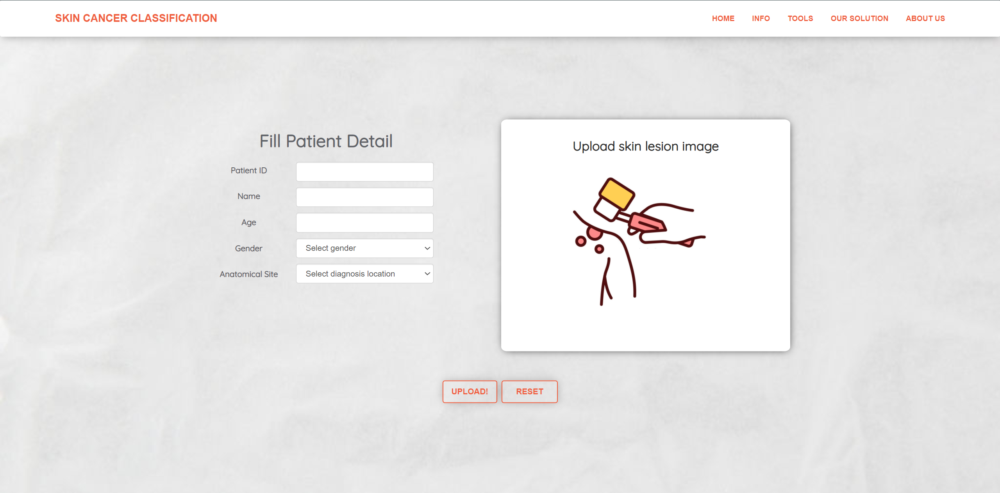

*Figure 16 Our Solution Page (Before Patient Details and Image Upload)*

The validated information is sent to the server on the **"Upload"** button click where the network is ready to the server (Figure 17). The optimised network analyses the image, returning the inference to the client (Figure 18). The inference is automatically populated in the interactive bar graph (Figure 18). The bar graph is easy to read, and it infers the chances of having skin cancer and its type. The information that the end-user has inserted into the **"Fill Patient Detail"** section (Figure 17) is automatically populated in the inference section (Figure 18) for users' convenience. Also, we have provided the functionality to generate the report that can be stored locally for later use (Figure 19) just by click on the **"Generate PDF"** button. The [PDF report](./readme_images/Patient_ID_ISIC%202029.pdf) includes the end-user information with the network prediction (Figure 19).

Moreover, we have also thought about patient privacy, and for the same reason, none of the patient demographic and skin lesion images are stored on the server. The server received the patient skin lesion image and performed the inference without storing it on the server.

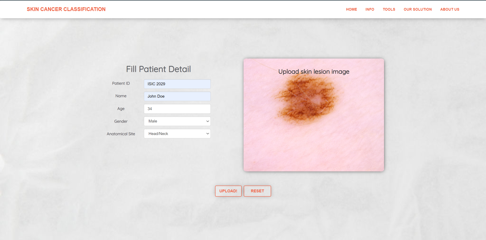

*Figure 17 Our Solution Page (After Patient Details and image Upload)*

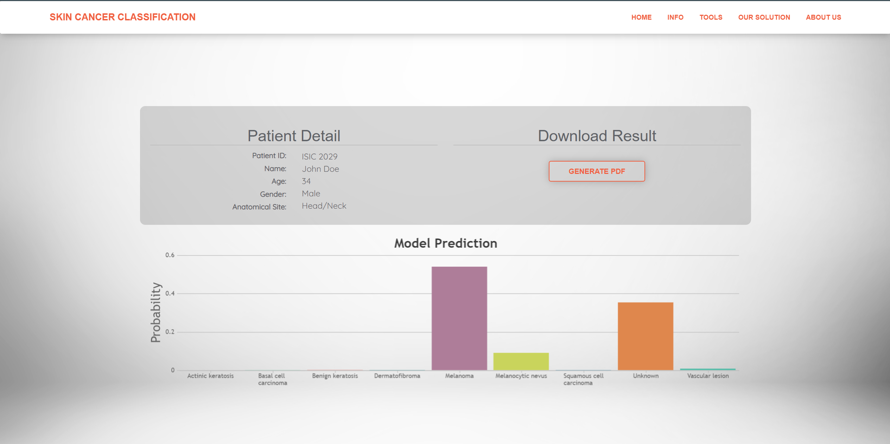

*Figure 18 Our Solution Page (Network inference)*

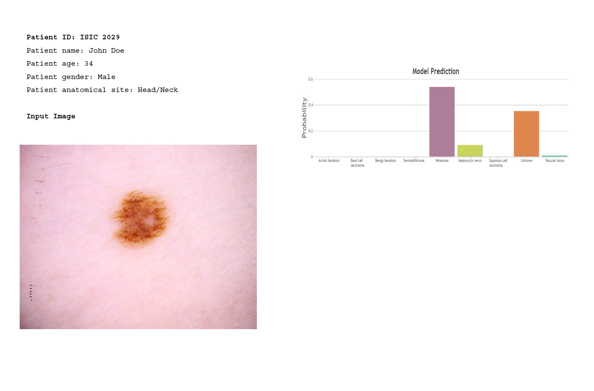

*Figure 19 Generated PDF report*

Lastly, we have created an **"About Us"** page (Figure 20). The **"About Us"** page shows the core value of individual team members and their effort to deliver the end product.

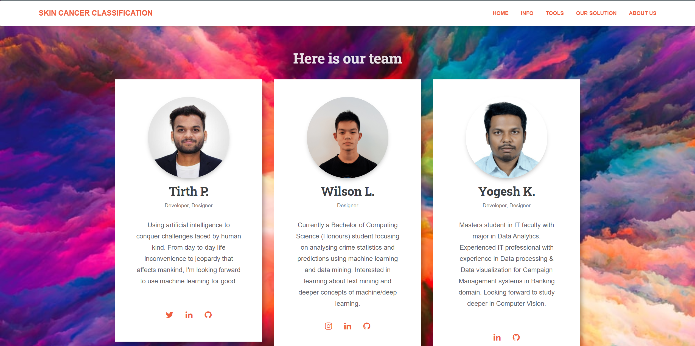

*Figure 20 About Us Page*

# Results and Evaluation
The model evaluation and performance on the test and validation images are as follows:

## Network Configurations
We have used ensemble terminology to train diverse models and take the average probability ranks of the models to get the final prediction. The model configuration is as follows:

1. [**Backbone Pre-trained CNN Model**](./Src/Model%20Training/model_param.py): *Efficient Net B4, B5 and B7*. We have chosen to use the B4, B5 and B7 variant of the efficient net over B0 as they have achieved higher accuracy on ImageNet competition.
2. **Targets**: All the model is trained on nine categories (Table 2).

| **Label** | **Name**                                                                             |
| --------- | ------------------------------------------------------------------------------------ |
| **Mel**   | Melanoma                                                                             |
| **AK**    | Actinic keratosis                                                                    |
| **UNK**   | Unknown                                                                              |
| **VASC**  | Vascular lesion                                                                      |
| **BKL**   | Benign keratosis (solar lentigo / seborrheic keratosis/lichen planus-like keratosis) |
| **NV**    | Melanocytic nevus                                                                    |
| **BCC**   | Basal cell carcinoma                                                                 |
| **DF**    | Dermatofibroma                                                                       |
| **SCC**   | Squamous cell carcinoma                                                              |

*Table 2, Label Name*

3. [**Original images are cropped**](https://www.kaggle.com/c/siim-isic-melanoma-classification/discussion/164092) to *68x768* and *512x512* pixels. To reduce the random noise and black border on the edge of the images (Figure 2)
4. [**Resized image input sizes**](./Src/Model%20Training/pre_train.py) to *380x380* and *448x448* pixels. The images are resized to lower resolution due to GPU memory constraints. Otherwise, it was planned to load the images with the original cropped image pixels (Table 4).
5. [**Cosine Decay learning rate**](./Src/Model%20Training/utils.py) is set to *3e-5* and *1e-5* with *1* **Warmup epoch**. Along with the pre-trained model, we are using Cosine decay with a warmup learning rate scheduler. Warmup strategy gradually increases the learning rate from zero to the initial learning rate during initial **Nth** epochs or **m** batches. Cosine decay is used in conjunction with the warmup learning rate scheduler to decrease the initial learning rate value steadily. Cosine decay is used rather than exponential or steps decay. It reduces the learning rate slowly at the start and end while falling linearly in the middle—cosine decay help to improve the training process (Figure 21).

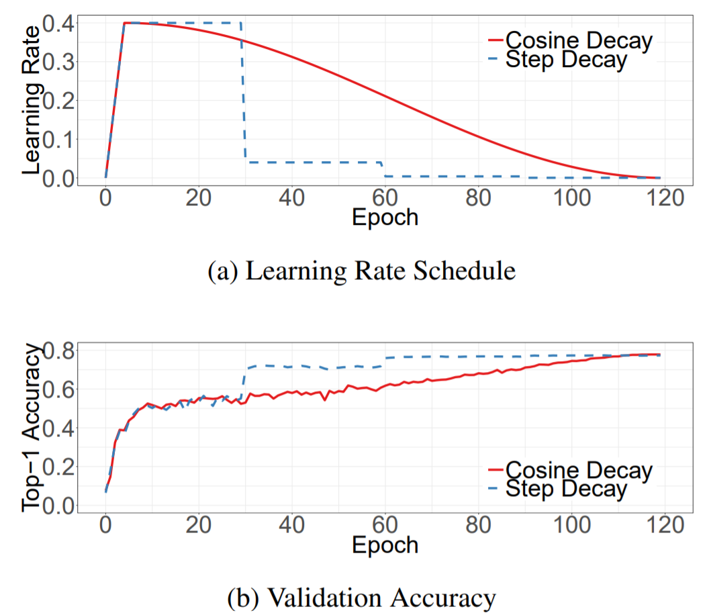

*Figure 21, Cosine Decay [(Tong et al., 2018)](https://arxiv.org/pdf/1812.01187.pdf)*

6. [**Optimiser**](./Src/Model%20Training/model_param.py): *Adam*. Adam combined the best properties of RMSProp and AdaGrad to handle the sparse gradients on the noisy problems. As we have sparse data, Adam is used because of the adaptive learning rate.
7. [**Training Epoch**](./Src/Model%20Training/model_param.py): *15*. As we are using the ensemble methodology, we have trained all the variants of the EfficientNet model on 15 epoch.
8. [**Training and validation batch size**](./Src/Model%20Training/model_param.py) of *8 for B4* and *4 for B5 and B7* is used. The reason behind choosing the small batch size is due to GPU memory constraints. Otherwise, we have planned to use a batch size of 64 for the training and validation set (Table 4).

## [Network Evaluation](./Src/Model%20Training/Model%20Logs/)
Almost all the EfficientNet model is getting the similar training and validation accuracy (Table 3). Based on the inference result in Table 3, the Efficient Net B5 model is getting the higher accuracy on the dataset. The final ensemble is a simple average of the three models' probability ranks. The model probability prediction is transformed to [0, 1] before averaging.

|     Model No    |  Backbone | Image Input Size |   Resize   | Batch Size | Training Accuracy | Validation Accuracy |
|:---------------:|:---------:|:----------------:|:----------:|:----------:|:-----------------:|:-------------------:|
|        2        |     B4    |        768       |     380    |      8     |         81%       |          91%        |
|        10       |     B5    |        512       |     448    |      4     |         85%       |          93%        |
|        16       |     B7    |        768       |     380    |      4     |         83%       |          92%        |
|     Ensemble    |           |                  |            |            |         83%       |          92%        |

*Table 3, the Model inference result*

# Model Evaluation and Deployment
The EfficientNet ensemble mechanism significantly improves the average prediction performance with reduction is variance component of prediction error (Table 3). The EfficientNet ensemble is able to generalise well as the models are getting higher accuracy on the validation set compared to the training set (Table 3).

From Figure 22, we can say that B4 generalised well on the unseen validation dataset. If the model is trained for a longer epoch, it can achieve higher accuracy. The validation loss fluctuates during the initial epoch, but it gets stable at the end of the training (Figure 22).  Also, the training and validation loss is decreasing continuously, which shows that training for a higher number of epochs can help achieve better results (Further detail about future opportunities is under ***Limitations, Future Extension, and Improvements section***). 

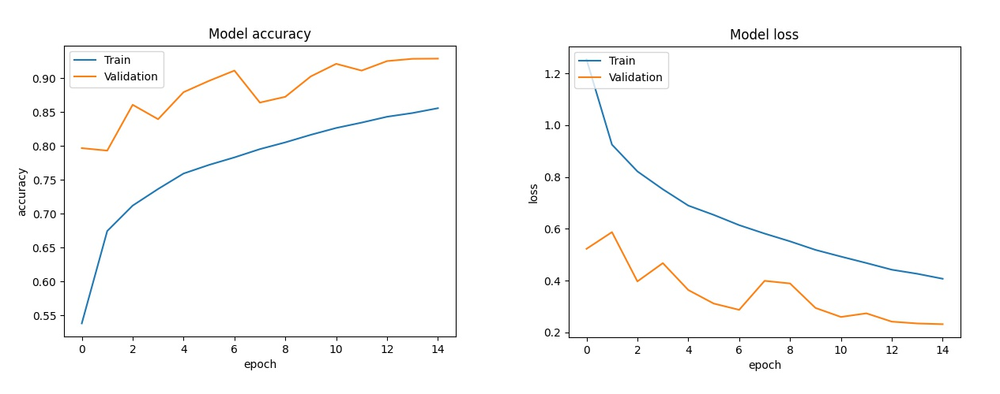

*Figure 22 EfficientNet B4 accuracy and loss*

Most of the attention is paid to optimising the model to achieve higher accuracy instead of serving the model's performance.  Significantly less information is available online about how to optimise the prediction of the trained model. When it comes to optimising the serving model, we need to focus on three things that are model size, prediction speed and prediction throughput. The model weights are not optimised, with B4, B5 and B7 having [1.64GiB, 2.56GiB and 2.78GiB of trained weights](https://www.kaggle.com/tirth27/melanoma-classification-kerasonnx-model-weight). The raw model weights are not ready for the serving because GPU is required to load the trained weights. 

The raw weights are converted into **Open Neural Network Exchange (ONNX)**. The key benefits of ONNX are its interoperability and hardware access. Once the model is converted into ONNX format, it can be quickly loaded into any hardware that supports ONNX and helps to minimise the inference time. **Also, the model weight is [reduced by 36% when converted into the ONNX format.](https://www.kaggle.com/tirth27/melanoma-classification-kerasonnx-model-weight)**

The optimised ONNX model is then deployed onto our CAD system, which can better support dermatologists' clinical work. The CAD system takes skin lesion and patient demographic as input and outputs the probability among the nine classes (Table 2).  

### Trained Weights

We have published our trained weigths of the model settings that are mentioned above in the [Kaggle](https://www.kaggle.com/tirth27/melanoma-classification-kerasonnx-model-weight).

## Limitations, Future Extension, and Improvements

The main drawback of the project is the computation power. The model is trained on [Azure Machine Learning with Standard NC 6 Instance](https://github.com/Tirth27/Skin-Cancer-Classification-using-Deep-Learning/blob/main/Src/README.md) with **6 Cores, 56GiB RAM, 1 NVIDIA Tesla K80 (11GiB GPU RAM) and 380GiB Disk space**. The configuration on which we have trained is not enough based on the EfficientNet architecture. To load the model on GPU, we have resized the image and reduced the batch size. The accuracy that we have achieved in Table 3 could be improved if we trained the B7 with an image resolution of 640. We are using the ensemble methodology, and it is expected that the bigger the ensemble, the more stable the accuracy score. To get a more stable accuracy score, we have proposed 18 different configurations (Table 4), which can be used to achieve a better result on the skin lesion dataset. The configuration is chosen while considering the model diversity that included backbone architecture and different targets. 

|     Model    |     Backbone    |     Target    |     Input    |     Resize    |     Metadata    |     Warmup LR    |     Epochs    |
|--------------|-----------------|---------------|--------------|---------------|-----------------|------------------|---------------|
|     1        |     B3          |     9c        |     768      |     512       |     Yes         |     3e-5         |     18        |
|     2        |     B4          |     9c        |     768      |     640       |                 |     3e-5         |     15        |
|     3        |     B4          |     9c        |     768      |     768       |                 |     3e-5         |     15        |
|     4        |     B4          |     9c        |     768      |     640       |     Yes         |     3e-5         |     15        |
|     5        |     B4          |     9c        |     1024     |     896       |                 |     2e-5         |     15        |
|     6        |     B4          |     9c        |     512      |     448       |                 |     3e-5         |     15        |
|     7        |     B5          |     9c        |     512      |     384       |     Yes         |     3e-5         |     15        |
|     8        |     B5          |     9c        |     768      |     640       |                 |     1.5e-5       |     15        |
|     9        |     B5          |     4c        |     768      |     640       |                 |     1.5e-5       |     15        |
|     10       |     B5          |     9c        |     512      |     448       |                 |     3e-5         |     15        |
|     11       |     B6          |     9c        |     768      |     640       |                 |     3e-5         |     15        |
|     12       |     B6          |     9c        |     768      |     576       |                 |     3e-5         |     15        |
|     13       |     B6          |     9c        |     512      |     448       |                 |     3e-5         |     15        |
|     14       |     B7          |     9c        |     512      |     384       |     Yes         |     3e-5         |     15        |
|     15       |     B7          |     9c        |     768      |     576       |                 |     1e-5         |     15        |
|     16       |     B7          |     9c        |     768      |     640       |                 |     1e-5         |     15        |
|     17       |     SE_X101     |     9c        |     768      |     640       |                 |     3e-5         |     15        |
|     18       |     Nest 101    |     9c        |     768      |     640       |                 |     2e-5         |     15        |

*Table 4, Proposed training configuration*

As proposed in Table 4, all the Models have nine classes except Model 9, which has four categories. The image should be read from the disk, dimension "Input", and then resized into the "Resize" dimension before passing into CNN. "Warmup LR" is the learning rate for the Cosine decay warmup epoch. Except Model 1 all the model is trained on 15 epochs. 

Secondly, the *single GPU takes longer to train with a single epoch of B4, B5 and B7 took 2.5hr, 4.7hr and 5.8hr, respectively*. Computation power is a significant drawback with any deeper and broader networks. If more than 7 NVIDIA Tesla V100 GPU is used in mixed precision, the training can be distributed between GPU, reducing the training time. 

Furthermore, CNN model robustness can be increased by the addition of 14 metadata features in some models: **sex**, **age_approx**, 10 one-hot encoded **anatom_site_general_challenge** features, **image_size** in bytes and **n_images**, where **n_images** is the number of all images of that patient in the data (Table 4). The metadata go through two fully connected layers before being concatenated with the CNN features, which then go to the final fully connected layer. The model architecture with metadata is illustrated in Figure 23. In three of four metadata models (Table 4), the two hidden layers have dimensions 512 and 128. In another metadata model, they are 128 and 32. We observe that models with images only perform better than metadata models overall, but the addition of of metadata models in the ensemble provides good model diversity.

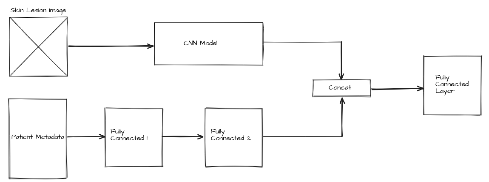

*Figure 23: The model architecture of metadata models.*

Moreover, we have a train on a very small batch size, which is not ideal for training the model because the smaller batch size is noisy and does not guarantee convergence at global optima. So if more than 7 GPU is used in parallel, then the batch size should be set to 64, which helps to get better generalisation on the dataset. 

The model is trained on a constant split; that is, the training and testing split remains the same in every model. But to ensure the splits are relatively unbiased, K-fold Cross-Validation can be used. A model can become robust if trained on a five-fold split. So, a single fold contains 15 epoch, and by the end of the training process, the model will be trained on five different holdouts set with 75 epoch in total (5 fold x 15 Epoch). K-fold Cross-Validation strategy only works if a more significant number of GPU are available as the EfficientNet model take longer to train.

Also, the project can be extended by detecting the skin cancer region with bounding boxes and providing the proportion of cancerous cell in the proposed region. It will help dermatologists understand where the network is looking, and it also helps improve the network performance if the wrong inference is performed.

Lastly, once we have optimised and train the model. The model should deploy on the Azure Kubernetes Service (AKS) for large scale inferencing. Keep the prediction throughput in mind that an AKS cluster should have a minimum of 3 nodes in parallel, which can handle multiple requests in a given timeframe. AKS is highly scalable and can handle multiple requests or batch prediction when deployed with a CAD system. 

# Conclusion

One of the deadliest cancer forms is melanoma, and the proportion of people getting affected by melanoma is increasing rapidly. To make the solution available to the public and dermatologists, we have successfully integrated the optimised model with our CAD system. 

The EfficientNet model is proved to be a better network for the skin cancer dataset. The network can generalise well on the dataset and have higher validation accuracy (Table 3 and Figure 22). Plus, the ensemble of the model helps to reduce model prediction error and biases. The model prediction error can be further reduced if the ensemble is more significant with varied configuration, as proposed in Table 4.

Along with optimising the training process, an equal amount of time is spent optimising the predictions. Based on the three core pillars of model serving, we have tick two of them: model size and latency. The last pillar (Prediction throughput) comes into account when the predictions are performed online over the internet. The prediction throughput measures how many predictions the system can perform in a given timeframe. The prediction throughput is beyond the project's scope but should be considered when deploying the model on the web. 

# References 

ISIC. (2018). Skin Lesion Analysis Towards Melanoma Detection. Retrieved March 20, 2021, from https://challenge2018.isic-archive.com/

ISIC. (2019). Skin Lesion Analysis Towards Melanoma Detection. Retrieved March 20, 2021, from https://challenge2019.isic-archive.com/

Mingxing, T., & Quoc, L. (2019). EfficientNet: Rethinking Model Scaling for Convolutional Neural Networks. https://arxiv.org/abs/1905.11946

SIIM-ISIC Melanoma Classification. (2020). Identify melanoma in lesion images. Retrieved March 20, 2021, from https://www.kaggle.com/c/siim-isic-melanoma-classification

Tong, H., Zhi, Z., Hang, Z., Zhongyue, Z., Junyuan, X., Mu, L. (2018). Bag of Tricks for Image Classification with Convolutional Neural Networks. https://arxiv.org/abs/1812.01187

Qishen, H., Bo, L., Fuxu L. (2020). Identifying Melanoma Images using EfficientNet Ensemble: Winning Solution to the SIIM-ISIC Melanoma Classification Challenge. https://arxiv.org/abs/2010.05351

# Credits
This project cannot be completed without you guys **Yogesh Babu Krishnakumar** [@github/13505538-Yogesh](https://github.com/13505538-Yogesh) and **Wilson Lukmanjaya** [@github/WLukmanjaya](https://github.com/WLukmanjaya). Thanks for your support :D
