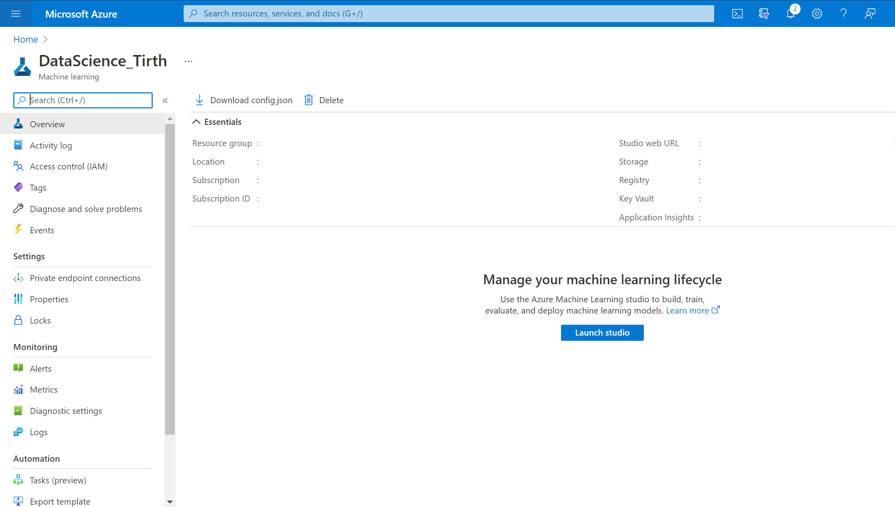
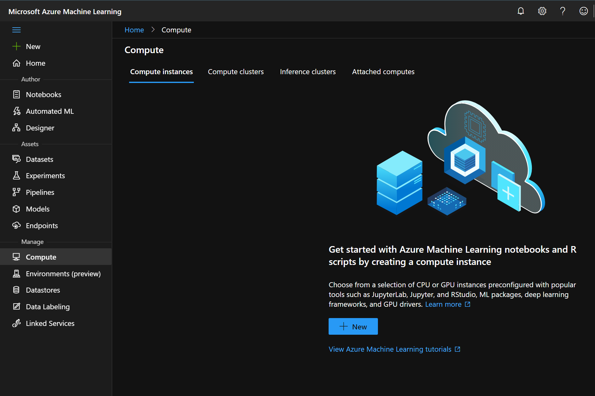
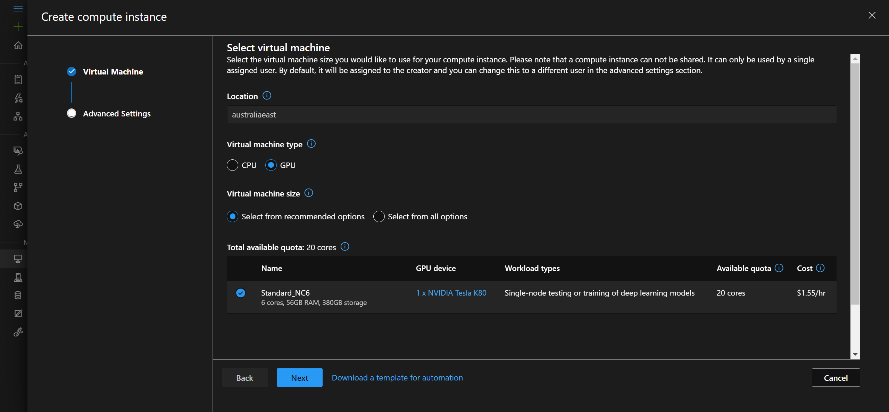

# [Quickstart: Create workspace resources you need to get started with Azure Machine Learning](https://docs.microsoft.com/en-us/azure/machine-learning/quickstart-create-resources)

## Prerequisites
An Azure account with an active subscription. [Create an account for free.](https://azure.microsoft.com/en-us/free/?WT.mc_id=A261C142F)

## Create the workspace
If you already have a workspace, skip this section and continue to [Create a compute instance](https://docs.microsoft.com/en-us/azure/machine-learning/quickstart-create-resources#instance).

If you don't yet have a workspace, create one now:
1. Sign in to the [Azure portal](https://portal.azure.com/) by using the credentials for your Azure subscription.
2. In the upper-left corner of the Azure portal, select the three bars, then **+ Create a resource**.

3. Use the search bar to find **Machine Learning**.
4. Select **Machine Learning**.

5. In the **Machine Learning** pane, select **Create** to begin.
6. Provide the required information to configure your new workspace.
7. After you're finished configuring the workspace, select Review + Create.
8. Select Create to create the workspace.
    When the process is finished, a deployment success message appears.
9. To view the new workspace, select **Go to resource**.
10. From the portal view of your workspace, select **Launch studio** to go to the Azure Machine Learning studio.

## Create compute instance

You could install Azure Machine Learning on your own computer. But in this quickstart, you'll create an online compute resource that has a development environment already installed and ready to go. You'll use this online machine, a compute instance, for your development environment to write and run code in Python scripts and Jupyter notebooks.

Create a *compute instance* to use this development environment for the rest of the tutorials and quickstarts.

1. If you didn't select **Go to workspace** in the previous section, sign in to [Azure Machine Learning studio](https://ml.azure.com/) now, and select your workspace.
2. On the left side, under **Manage**, select **Compute**.

3. Select **+New** to create a new compute instance.
4. Keep all the defaults on the first page, select **Next**.

5. Supply a name and select **Create**.

In about two minutes, you'll see the **State** of the compute instance change from *Creating* to *Running. It's now ready to go.

